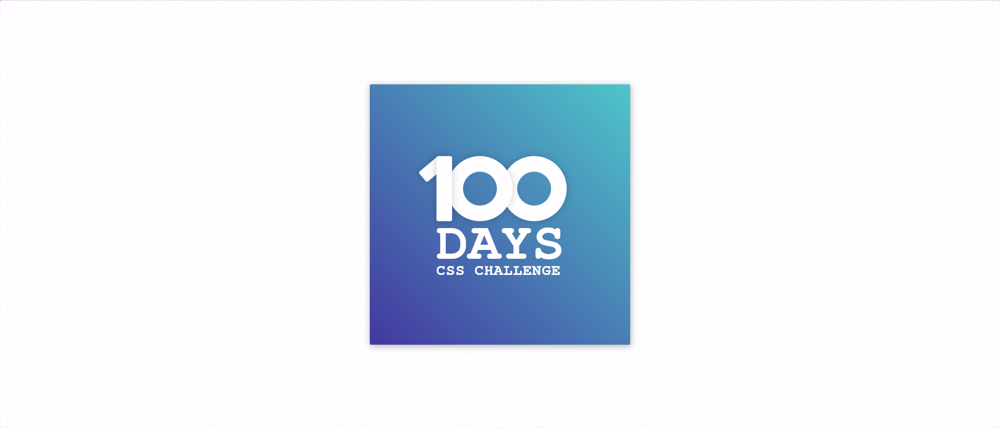

### Day1
### 效果图


### 启动
1.npm i anywhere -g
2.进入day1目录在cmd或者终端输入anywhere回车
3.在页面打开返回返回的链接
4.点击day1.html
### 知识点

1.背景色线性渐变

```css
    //以下代码全是从左下到右上的渐变
    background: -webkit-linear-gradient(bottom left,#43389F 0%,#4ec6ca 10%);
    //为了兼容性上面代码会和下面代码同时出现
    background: -moz-linear-gradient(bottom left,#43389F 0%,#4ec6ca 10%);
    background: -o-linear-gradient(bottom left,#43389F 0%, #4ec6ca 10%);
    backgorund: linear-gradient(to top right,#43389F 0%, #4ec6ca 10%);
    //兼容ie
    filter: progid:DXImageTransform.Microsoft.gradient( startColorstr='#43389F', endColorstr='#4ec6ca',GradientType=1 ); 
```
2.字体抗锯齿

```css
    -webkit-font-smoothing:antialiased;
    -moz-osx-font-smoothing:grayscale;
```

3.屏幕中心
```css
    //表示向上，向左移动自身元素高宽的50%
    transform: translate(-50%,-50%)
```
4.子绝父相
    使用本身的父级元素来定位，自身相对定位并用宽高撑满父元素，子级元素使用绝对定位使子级元素在自身内部定位
5.转动
```css
    //以左上角为圆心顺时针旋转50度
    transform:rotate(50deg);
```
6.重新定义宽高
```css
    //使内边距和边框的宽度计算至元素宽高内部
    //假如定义一个100px的div那么他的外层还有padding，border，margin
    //box-sizing将padding和border统计到div的100px内
    box-sizing: border-box
```
7.阴影
```css
    //参数分别为:水平偏移量 垂直偏移量 模糊半径 颜色
    box-shadow:0 0 13px rgba(0, 0, 0, 0.2)
```
8.控制大小写
```css
    //转为大写
    text-transform:uppercase 
```
9.字间距
```css
    //字符之间的距离
    letter-spacing:0.04em; 
```