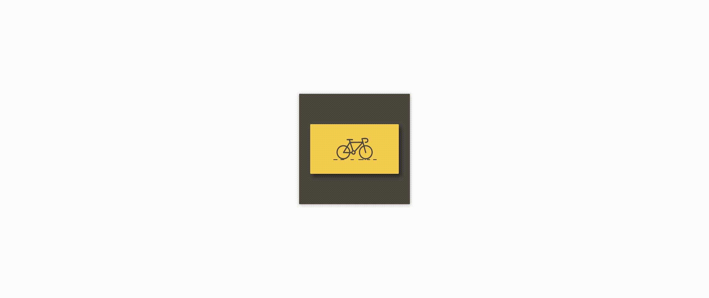

### day12
### 效果图


### 启动
1.npm i anywhere -g
2.进入day12目录在cmd或者终端输入anywhere回车
3.在页面打开返回返回的链接
4.点击day12.html
### 调试scss
1. 安装sass: npm i sass -g
2. 终端进入day12
3. 执行sass --watch ./day12.scss ./day12.css
4. 保存scss时会自动更新css

### 知识点
1. backface-visibility: hidden;

```scss
/**backface-visibility: hidden; 意思是元素的背面在旋转时是否可见。如果为 hidden，则旋转时元素的背面将不可见，如果为 visible，则旋转时元素的背面将可见。这通常是在进行3D变换的时候使用的。 */
{
    backface-visibility: hidden;
}
```