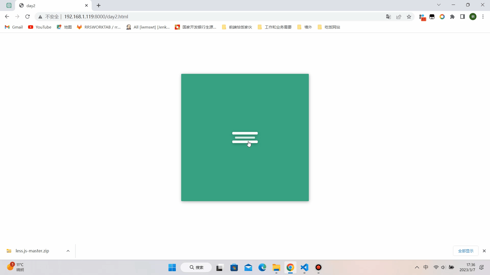

### Day2
### 效果图


### 启动
1.npm i anywhere -g
2.进入day1目录在cmd或者终端输入anywhere回车
3.在页面打开返回返回的链接
4.点击day2.html
### 知识点

1. less全局变量声明

```css
/* 使用@声明变量 */
@menu-icon-line-height: 8px;
div{
  height:@menu-icon-line-height
}
```
2. 背景颜色的变化过渡
```css
transition: background-color .2s ease-in-out;
```
3. animation
```css
/* 将元素的"animation"属性设置为"animate-line-1-rev"，即将应用"animate-line-1-rev"关键帧动画。
将动画执行时间设置为0.7秒，即动画持续0.7秒。
将动画的动态变化曲线设置为"cubic-bezier-in"，即使用"ease-in"缓动函数控制动画的速度变化。
将动画结束后元素的状态设置为"forwards"，即动画结束时元素保持最后一帧的状态。 */
animation: animate-line-1-rev .7s @cubic-bezier-in forwards;
@cubic-bezier-in: cubic-bezier(0.30,1,0.70,1);
```
这里面又细分关键帧动画和贝塞尔曲线两个知识点，以下是定义的关键帧动画
```css
@keyframes animate-line-1-rev {
    /* 这是一个CSS 3D变换的组合，由两个部分组成：

translate3d(0, 22, 0)：这是一个3D平移变换，将元素沿着X轴、Y轴和Z轴分别移动0像素、22像素和0像素。

rotate(45deg)：这是一个2D旋转变换，将元素绕着其原点顺时针旋转45度。

这两个变换组合在一起，会使元素向上平移并以45度的角度旋转。这个变换通常用于制作动画效果或视觉效果，可以让元素在3D空间中移动、旋转或缩放。 */
  0% {
    transform: translate3d(0, 22, 0) rotate(45deg);
  }
  50% {
    transform: translate3d(0, 22, 0) rotate(0);
  }

  100% {
    transform: translate3d(0, 0, 0) rotate(0deg);
  }
}
```
后者就是贝塞尔曲线函数cubic-bezier(),它可以作为animation的第三个参数定义动画的速度
<image src="./贝塞尔曲线.png" />

4. 使元素缩小消失以及复原

```css
/* 消失 */
@keyframes animate-line-2 {
  0% {
    transform: scale(1);
    opacity: 1;
  }
  100% {
    transform: scale(0);
    opacity: 0;
  }
}
/* 逐渐变大出现 */
@keyframes animate-line-2-rev {
  0% {
    transform: scale(0);
    opacity: 0;
  }
  100% {
    transform: scale(1);
    opacity: 1;
  }
}
```
5. 禁用动画效果

```css
 /* 这段less代码定义了一个名为"no-animation"的类，它用于禁用元素的动画效果。具体来说，通过此类，当应用在某个元素上时，它会执行以下操作：

 将元素的"-webkit-animation"属性设置为"none"，即禁用Webkit浏览器下的动画效果。
 将元素的"animation"属性设置为"none"，即禁用非Webkit浏览器下的动画效果。
 这个类通常用于在需要临时禁用动画效果的场景中，例如当页面正在加载时，禁用动画效果可以减轻页面的负担，加速页面加载；或者在特殊的交互场景中，禁用动画可以使得页面具有更好的交互体验。"!important"是一个CSS属性的特殊关键字，表示当前属性的优先级高于其他属性，无论其他属性的权重如何，都会应用当前属性的值。 */
.no-animation {
	-webkit-animation: none !important;
          animation: none !important; 
}
```
6. less关于&的用法

```css
.menu-icon {
  &:hover{
    //meun-icon鼠标悬浮时的样式声明
    ...
  }
  &.active{
    //class为"meun-icon active"的样式声明
    ...
  }
}
```