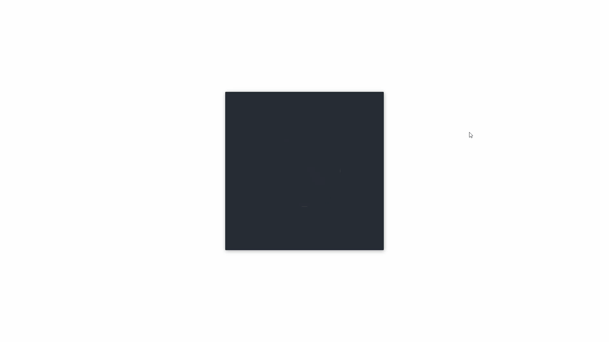

### Day3
### 效果图


### 启动
1.npm i anywhere -g
2.进入day3目录在cmd或者终端输入anywhere回车
3.在页面打开返回返回的链接
4.点击day3.html
### 知识点

1. 圆形框选

```css
    /* 这段 less 代码表示将一个圆形剪切路径应用于元素，其半径为 90 像素，圆心位于 (90px，90px) 的位置。这意味着元素的内容将只显示在圆形区域内，并被剪切在该圆形路径之外的部分将被移除。这通常用于创建有趣的视觉效果或蒙版效果。  */
    clip-path: circle(90px at 90px 90px);
```
2. 改变旋转原点

```css
    /* 这段 less 代码表示元素进行转换时的变换原点（transform origin）被设置为相对于元素的宽度和高度分别为 50% 和 400% 的位置。这意味着将使用该点作为变换的中心点，而不是默认的中心点（元素的中心点）。具体来说，将在距离元素顶部 4 倍高度处的水平中心点进行变换。这通常用于实现旋转、缩放等操作，从而使变换效果更精确或更具有视觉吸引力 */
    transform-origin: 50% 400%;

```
3. 三角形框选

```css
    /* clip-path: polygon(115px 0%, 231px 0%, 100% 100%) 
     表示将使用一个三角形剪切路径来裁剪元素，这个三角形的顶点分别在
     (115px, 0%)，(231px, 0%) 和 (100%, 100%) 的位置。这将导致素
     只显示三角形区域内的内容，而区域外的部分将被裁剪掉。
     这种技术通常用于创建动画效果，比如元素出现或消失的效果，
     或者创建类似遮罩层的效果。 */
     clip-path: polygon(115px 0%, 231px 0%, 100% 100%) 

```

4. y轴拉伸收缩

```css
    /* 这段 less 代码表示在关键帧动画的第 0% 时刻，
    元素将会被应用一个 scaleY(0) 的变换，
    并且一个多边形的剪切路径将会被应用。 
    具体来说，scaleY(0) 表示元素在 y 轴方向上被压缩到 0，
    即变成一条水平的线。 */
    transform: scaleY(0);//0-1取值
```