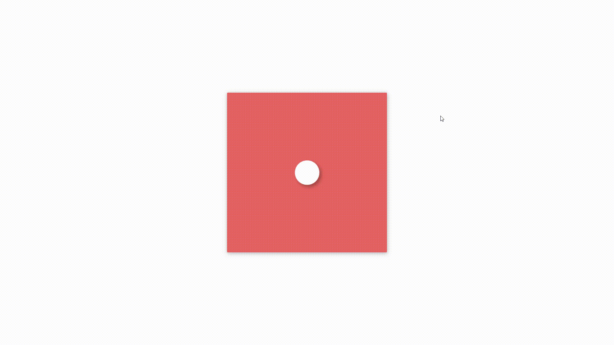

### Day4
### 效果图


### 启动
1.npm i anywhere -g
2.进入day4目录在cmd或者终端输入anywhere回车
3.在页面打开返回返回的链接
4.点击day4.html
### 知识点
1. 动画无限正逆循环

```css
/* infinite: infinite 是一个动画迭代次数的关键字，用于指示动画应该无限循环播放而不停止。如果将它作为动画的迭代次数，那么动画将在到达最后一帧后立即从第一帧重新开始，不断播放。

alternate: alternate 是一个动画播放方式，用于指示动画应该来回循环播放而不是一直往前播放。具体来说，动画将在每个迭代结束时反向播放，然后在下一个迭代中再次正向播放。这个播放方式可以与 infinite 结合使用，实现一个往返无限循环的动画效果。在这种情况下，动画将永远来回循环，而不是在到达最后一次迭代后停止。 */
	animation: jump-jump-1 2s @bezier infinite alternate;
```
2. 动画停留最后一帧

```css
/**等同于animation(x x x forwards) */
animation-fill-mode: both;
```