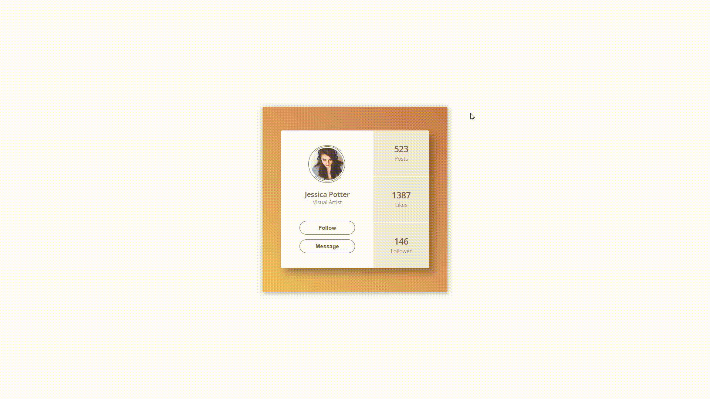

### Day5
### 效果图


### 启动
1.npm i anywhere -g
2.进入day5目录在cmd或者终端输入anywhere回车
3.在页面打开返回返回的链接
4.点击day5.html
### 知识点
1. animation 和 transition 的区别


　　animation 可以用 name 设置动画的名称，用 duration 设置动画完成的周期，用 timing-function 设置动画的速度曲线，delay 设置动画什么时候开始，iteration-count 设置动画播放的次数，direction 规定下一个周期是否逆向的播放，play-state 动画是否正在进行或者暂停，fill-mode 设置动画停了之后位置什么状态

　　transition 用 property 去设置过渡效果的属性名称，duration 设置过渡效果的周期，timing-function 规定速度效果的速度曲线，delay 设定过渡效果什么时候开始；

　　

　　区别：

　　　　1、transition 是过渡，是样式值的变化的过程，只有开始和结束；animation 其实也叫关键帧，通过和 keyframe 结合可以设置中间帧的一个状态；

　　　　2、animation 配合 @keyframe 可以不触发时间就触发这个过程，而 transition 需要通过 hover 或者 js 事件来配合触发；

　　　　3、animation 可以设置很多的属性，比如循环次数，动画结束的状态等等，transition 只能触发一次；

　　　　4、animation 可以结合 keyframe 设置每一帧，但是 transition 只有两帧；

　　　　5、在性能方面：浏览器有一个主线程和排版线程；主线程一般是对 js 运行的、页面布局、生成位图等等，然后把生成好的位图传递给排版线程，而排版线程会通过 GPU 将位图绘制到页面上，也会向主线程请求位图等等；我们在用使用 aniamtion 的时候这样就可以改变很多属性，像我们改变了 width、height、postion 等等这些改变文档流的属性的时候就会引起，页面的回流和重绘，对性能影响就比较大，但是我们用 transition 的时候一般会结合 tansfrom 来进行旋转和缩放等不会生成新的位图，当然也就不会引起页面的重排了
2. border-color四个参数

```css
    /* 顺时针上右下左 */
	border-color: @brown transparent @brown @brown;
```