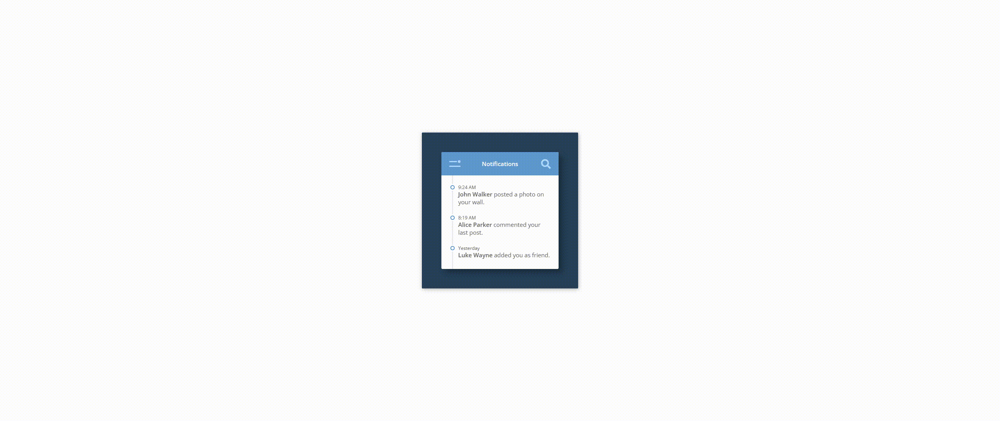

### Day6
### 效果图


### 启动
1.npm i anywhere -g
2.进入day6目录在cmd或者终端输入anywhere回车
3.在页面打开返回返回的链接
4.点击day6.html
### 知识点
1. less使用for循环

```css
     /* less定义循环 */
     div{
        .loop(@n) when (@n <=4) {
            /**注意 ：(@{n}) 形式 */
            &:nth-child(@{n}) {
                animation: here-am-i .5s ease-out (@n / 5s);
                animation-fill-mode: both;
            }

            .loop((@n + 1));
        }

        .loop(2);
     }
```
2. h5中svg标签

```css
    /* 这段代码是一个 SVG 图标，包含一个搜索图标的路径。以下是各个属性的解释：
    viewBox：指定 SVG 坐标系的范围，这里是 (0, 0) 到 (512, 512)。
    width：指定 SVG 图标的宽度为 25 个单位。
    title：为 SVG 图标添加一个标题，当鼠标悬停在图标上时会显示这个标题。
    class：为 SVG 图标添加一个样式类名。
    path 元素是 SVG 中的一个形状元素，它的 d 属性定义了图形的路径。在这个例子中，d 属性定义了一个复杂的路径，形成了一个搜索图标的形状。
    总的来说，这段代码的作用是在网页中嵌入一个搜索图标，可以在图标上添加鼠标悬停提示，并通过 CSS 控制样式。 */
    <svg viewBox="0 0 512 512" width="25" title="search" class="search-icon">
        <path d="M505 442.7L405.3 343c-4.5-4.5-10.6-7-17-7H372c27.6-35.3 44-79.7 44-128C416 93.1 322.9 0 208 0S0 93.1 0 208s93.1 208 208 208c48.3 0 92.7-16.4 128-44v16.3c0 6.4 2.5 12.5 7 17l99.7 99.7c9.4 9.4 24.6 9.4 33.9 0l28.3-28.3c9.4-9.4 9.4-24.6.1-34zM208 336c-70.7 0-128-57.2-128-128 0-70.7 57.2-128 128-128 70.7 0 128 57.2 128 128 0 70.7-57.2 128-128 128z"></path>
    </svg>
```

