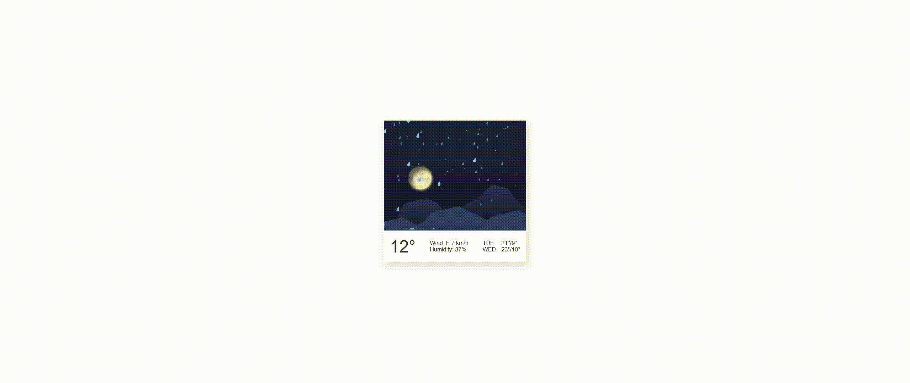

### Day8
### 效果图


### 启动
1.npm i anywhere -g
2.进入day8目录在cmd或者终端输入anywhere回车
3.在页面打开返回返回的链接
4.点击day8.html
### 调试scss
1. 安装sass: npm i sass -g
2. 终端进入day8
3. 执行sass --watch ./day8.scss ./day8.css
4. 保存scss时会自动更新css

### 知识点

1. scss中@mixin

```scss
//定义
// 这段 SCSS 代码定义了一个名为 keyframesLetItRain 的 mixin，它接受两个参数：$version 和 $scale。该 mixin 定义了一个 @keyframes 规则，命名为 let-it-rain-$version，其中 $version 取决于传入的参数。该 @keyframes 规则定义了一个动画序列，其中在动画开始时，元素将向右上方倾斜并向下移动，直到 80% 的时间，元素将停止移动并保持倾斜状态。在动画的最后 20% 的时间内，元素将沿着 Y 轴缩小并沿着 X 轴扩展，以模拟雨滴掉落的效果。动画使用了 $scale 参数来调整元素的大小和位置。
@mixin keyframesLetItRain($version, $scale){
        @keyframes let-it-rain-#{$version}{
        0% {
        transform: translate3d(20px,-320px,0) scaleX($scale) scaleY($scale) rotate(17deg);
        }
        80%{
            transform: translate3d(0,0,0) scaleX($scale) scaleY($scale) rotate(17deg);
        }
        100%{
            transform: translate3d(0,0,0) scaleX($scale*3) scaleY(0)
        }
    }
}

//调用
// 这段 SCSS 代码使用了 mixin 和 keyframes 属性，其含义如下：

// @include 是 SCSS 中使用 mixin 的一种方式，用于调用一个 mixin，并将其参数传递给它。
// keyframes 是 CSS 的一种属性，用于定义动画的关键帧。
// keyframesLetItRain 是一个 mixin 名称，表示定义一个名为 LetItRain 的动画关键帧。
// (1, 1) 是传递给 mixin 的两个参数值，用于控制动画关键帧中的样式变化。具体含义根据 mixin 的定义而定。
// 综上，这段 SCSS 代码的含义是调用名为 LetItRain 的动画关键帧 mixin，并传递两个参数值。这段代码的具体作用需要根据 mixin 的定义来确认
@include keyframesLetItRain(1, 1);
```

2. scss中@function

```scss
//定义函数
@function randomNum($min, $max) {
  $rand: random();
  $randomNum: $min + floor($rand * (($max - $min) + 1));

  @return $randomNum;
}
//调用
#{randomNum(0.01, 0.08)}
```

3. @mixin与@function的区别

```
在 SCSS 中，@mixin 和 @function 都可以用来创建可重复使用的代码块，但它们之间存在一些区别。
@mixin 是用来定义一组样式规则的模板，可以接受参数，但不返回值。主要用来避免代码的重复和提高代码的可维护性，可以在任何需要的地方调用它来生成相应的样式规则。
@function 定义的也是一个可重复使用的代码块，但 @function 中的代码块会返回一个计算值，可以接受参数，但必须返回一个值，不能生成 CSS 规则。@function 通常用于计算值和处理数据，而不是生成样式。
因此，@mixin 和 @function 的主要区别在于作用。@mixin 用于生成样式规则，而 @function 用于处理数据和计算值，通常用于特定的数学运算和逻辑处理。
```

4. scss中的for循环与条件判断

```scss
@for $i from 1 through 42{

    .start-#{$i}{
        ...
    }
    @if $i <11{
        ...
    }

}
```

5. scss中的变量声明和变量使用

```scss
// 在 SCSS 中，使用变量时需要在外层加上 #{ } 这个插值语法的情况包括以下几种情况：

// 字符串拼接：当字符串中需要插入一个变量值时，需要使用插值语法将变量值插入到字符串中。例如：

$color: red;
.box {
  border: 1px solid #{$color};
}
// 属性名拼接：有时候需要将变量用于属性名的拼接，也需要使用插值语法。例如：

$property: border;
.box {
  #{$property}-color: red;
}
// CSS 函数中使用：有些 CSS 函数支持将变量作为参数使用，此时需要使用插值语法。例如：

$font-size: 14px;
.box {
  font-size: calc(#{$font-size} / 2);
}
// 在其他情况下，变量不需要使用插值语法，例如直接使用变量赋值给属性值时：

$color: red;
.box {
  color: $color;
}


```
6. 继承

```scss
div{
@extend .parent
}

```

7. 伪元素

```scss
//在该元素的前面放一个元素块
&:before{

}
//在该元素的后面放一个元素块
&:after{


}
```
8. sass中的math包

```scss
@use "sass:math";
// "sass:math" 模块中包括了许多常用的数学运算函数，例如：

sin($value): 返回给定角度的正弦值。
cos($value): 返回给定角度的余弦值。
tan($value): 返回给定角度的正切值。
atan($value): 返回给定数字的反正切值。
sqrt($value): 返回给定数字的平方根。
pow($base, $exponent): 返回 $base 的 $exponent 次幂的值。
abs($value): 返回给定数字的绝对值。
ceil($value): 返回输入数字的向上取整值。
floor($value): 返回输入数字的向下取整值。
round($value): 返回输入数字的四舍五入值。
random($value): 返回一个 0 到 value 之间的随机数。
这些函数在 CSS 编写中非常有用，可以用于实现复杂的动画效果、计算布局的位置和大小等等。
```